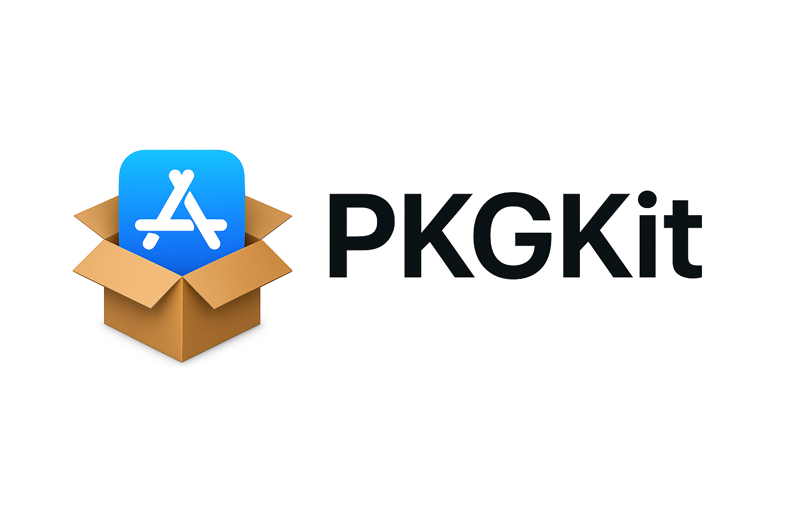

# PKGKit by Pedro M. Moreno
[]()
[]()

**PKGKit** is a lightweight toolkit of Bash scripts that automate the process of archiving, packaging, signing, and preparing a `.pkg` installer for a macOS application.  

It is designed to be **self-contained and developer-friendly**: everything lives inside the `scripts/` folder, with no external environment variables required.  

---

## 🚀 Table of Contents

1. [Repository Structur](#repository-structure)
2. [File-by-file overview](#file-overview)
3. [Usage Guide](#usage-guide)
4. [Typical Developer Flow](#dev-flow)  
5. [Troubleshooting](#troubleshooting)  
6. [Notes](#notes)  

---

<a name="repository-structure"></a>
## 📂 Repository Structure

``` bash
scripts/
├── master.sh # Main entry point: orchestrates the entire flow
├── build_archive.sh # Archives the Xcode project/scheme into a .xcarchive
├── extract_app.sh # Extracts the .app bundle from the archive
├── build_pkg.sh # Builds and signs the .pkg installer
├── clean_up.sh # Removes extracted temporary .app
├── colors.sh # Shared ANSI color palette for nicer CLI output
├── config.sh # Per-developer configuration (committed with placeholders)
├── config.example.sh # Example config (reference)
└── lib/
    ├── config_utils.sh # Load/save helpers for config.sh
    ├── identity_utils.sh # Keychain identity discovery + selection prompt
    └── project_utils.sh # Project detection (.xcodeproj/.xcworkspace
```
---

<a name="file-overview"></a>
## 📘 File-by-file overview

### High-level scripts
- **`master.sh`** → The central orchestrator.  
  Loads helpers, resolves identities (prompt if needed), detects project and scheme, and sequentially calls the other scripts (`build_archive.sh`, `extract_app.sh`, `build_pkg.sh`, `clean_up.sh`).  

- **`build_archive.sh`** → Archives the Xcode project/scheme into a `.xcarchive`, producing a universal binary (`x86_64` + `arm64`). Supports manual or automatic signing.  

- **`extract_app.sh`** → Extracts the `.app` bundle from the `.xcarchive` into the build directory.  

- **`build_pkg.sh`** → Creates a `.pkg` component from the `.app` using `pkgbuild`, then signs the installer with `productsign`.  

- **`clean_up.sh`** → Removes the extracted `.app` bundle after packaging.  

- **`colors.sh`** → Centralized ANSI color definitions for consistent CLI output.  

### Config files
- **`config.sh`** → Developer-specific configuration (committed with empty placeholders). On first run, `master.sh` will prompt for missing values and persist them here.  
- **`config.example.sh`** → Example template with commented values for reference.  

### Lib helpers
- **`config_utils.sh`** → Functions for loading/saving keys inside `config.sh`. Handles both GNU and BSD/macOS `sed`.  
- **`identity_utils.sh`** → Detects Developer ID certificates in the Keychain, presents a numbered list to the user, and persists the chosen identity into `config.sh`.  
- **`project_utils.sh`** → Detects `.xcodeproj` or `.xcworkspace` at the repo root and infers the scheme name.  

---

<a name="usage-guide"></a>
## 🚀 Usage Guide

### 1. Place PMM_PKGKit in your project root
The `scripts/` folder must live **at the root of your macOS project**, where your `.xcodeproj` or `.xcworkspace` is located.

- **If you already have a project**:  
  Clone PMM_PKGKit *into your project root*:
  ``` bash
  cd /path/to/your/project-root
  git clone <this-repo-url> scripts
  ```

  Example structure:
  ``` swift
  MyApp.xcodeproj
  MyApp/
  scripts/
  ```

- **If you want a standalone test**:    
  Clone the repo anywhere and place a sample `.xcodeproj/.xcworkspace` in the same root.  


### 2. Make scripts executable
 ``` bash
chmod +x scripts/*.sh
chmod +x scripts/lib/*.sh
 ```

### 3. Configure signing identities
Open `scripts/config.sh.` By default:
 ``` bash
TEAM_ID=""
SIGN_ID_APP=""
SIGN_ID_INSTALLER=""
 ```
- TEAM_ID → Optional. Your Apple Developer Team ID (e.g. ABCDE12345).
- SIGN_ID_APP → Your Developer ID Application certificate common name.
- SIGN_ID_INSTALLER → Your Developer ID Installer certificate common name.

If left empty, `master.sh` will:
1. Scan your Keychain for matching certificates.
2. Prompt you to select one.
3. Save your choice back into `config.sh` (so you don’t need to enter it again).  

### 4. Run the build
From the project root:
 ``` bash
./scripts/master.sh
 ```
This will:
1. Detect the Xcode project/workspace.
2. Archive the macOS scheme (Release, universal).
3. Extract the `.app` bundle.
4. Read bundle identifier and version from `Info.plist`.
5. Build and sign the `.pkg`.
6. Clean up the extracted `.app`.
7. Offer to open the signed installer.

---

<a name="dev-flow"></a>
## 🧑‍💻 Typical Developer Flow
1. **First run** → Run `./scripts/master.sh`. Missing identities will be prompted and saved into config.sh.
2. Subsequent runs → Just run `./scripts/master.sh` — it uses your saved config, no prompts.

---

<a name="trubleshooting"></a>
## 🔧 Troubleshooting
- **No Developer ID certificates found**  
  → Install your Developer ID Application/Installer certificates in Keychain.
- **Permission denied when running scripts**
  → Ensure you ran `chmod +x scripts/*.sh scripts/lib/*.sh`.
- **Signing errors when archiving**
  → Leave `SIGN_ID_APP=""` to fallback to `CODE_SIGN_STYLE=Automatic`, and check your Xcode signing settings.


---

<a name="notes"></a>
## 📌 Notes
- PMM_PKGKit is **macOS-only**, as it depends on Xcode tools and Apple’s code-signing infrastructure.
- Intended for **developer machines**, not CI pipelines (although it could be adapted).
- Notarization is not included; it can be added later with Apple’s `notarytool`.
  
